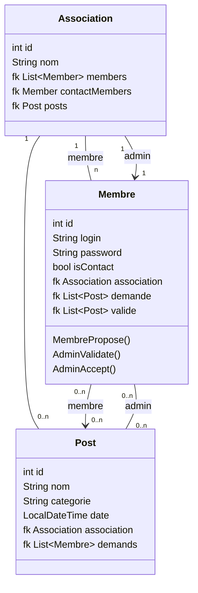
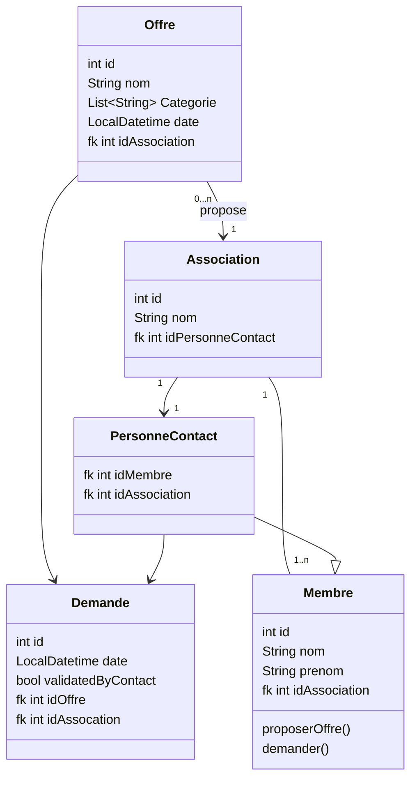

# La source

```mermaid
classDiagram
    
    Association "1" -- "n" Membre : membre
    Association "1" --> "1" Membre : admin
    Association "1" -- "0..n" Post
    Membre "0..n"--> "0..n" Post : membre
    Membre "0..n" -- "0..n" Post : admin
    
    
    class Association{
        int id
        String nom
        fk List~Member~ members
        fk Member contactMembers
        fk Post posts
    }
    
    class Membre{
        int id
        String login
        String password
        bool isContact
        fk Association association
        fk List~Post~ demande
        fk List~Post~ valide
        MembrePropose()
        AdminValidate()
        AdminAccept()
    }
    
    class Post{
        int id
        String nom
        String categorie
        LocalDateTime date
        fk Association association
        fk List~Membre~ demands
    }
```

```mermaid
classDiagram
    Association "1" -- "1..n" Membre
    Association "1" --> "1" PersonneContact
    PersonneContact --|> Membre
    Offre --> Demande
    PersonneContact --> Demande
    Offre "0...n" --> "1" Association: propose
    class Association{
        int id
        String nom
        fk int idPersonneContact
    }
    class PersonneContact{
        fk int idMembre
        fk int idAssociation
    }
    class Membre{
        int id
        String nom
        String prenom
        fk int idAssociation
        proposerOffre()
        demander()
    }
    class Offre{
        int id
        String nom
        List~String~ Categorie
        LocalDatetime date
        fk int idAssociation
    }
    class Demande{
        int id
        LocalDatetime date
        bool validatedByContact
        fk int idOffre
        fk int idAssocation
    }
```

